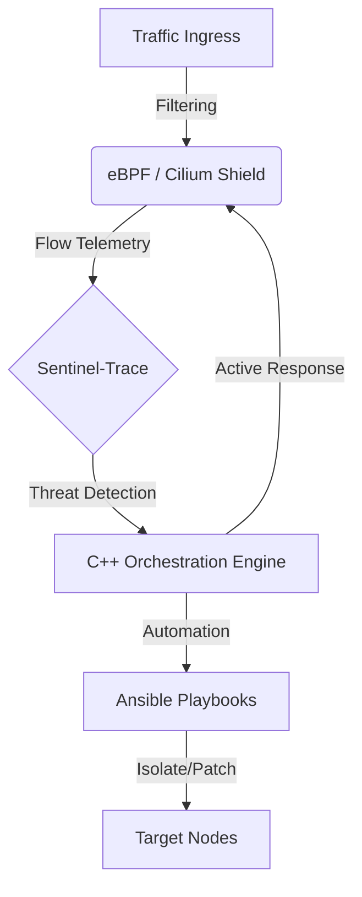

# 🛡️ Sovereign Shield: Genesis


## *** Sovereign Shield is one of the eyeC Triplets***
[🔗 Explore the project](https://github.com/eyeC-DevSecOps-project)

---

## 🔰 Phase I — Foundations

This phase describes the setup of the **core infrastructure** and an **eBPF-based firewall** using **K3s + Cilium**.  


## 📁 Project Structure

```

├── ansible/            # 🤖 Automation & IaC
│   ├── policies/       # Cilium L3/L4/L7 security rules
│   │   └── shield-policy.yaml
│   └── scripts/        # Deployment & Configuration playbooks
│       ├── deploy_shield.yml
│       └── enable_hubble.yml
├── .gitignore          # 🛡️ Protection against temp files (~$ / .tmp)
├── README.md
└── inventory.example.ini
```
***Flow:***


## 🧰 Requirements

Kali, Debian and Windows VMs (NAT / Internal Network)

Ansible

Note
Ansible is used to automate node configuration.
Ansible permet d’automatiser la configuration des nœuds.

### 📋 1. Ansible Setup

Goal / Objectif
Install the orchestration tool on the control machine (Kali).
Installer l’outil d’orchestration sur la machine de contrôle (Kali).
```
sudo apt update && sudo apt install ansible -y
ansible --version
```
### 🏗️ 2. VM Provisioning

Goal / Objectif
Deploy nodes for the security lab.
| Machine       | OS              | Role                            | RAM  |
| ------------- | --------------- | ------------------------------- | ---- |
| Control-Plane | Debian / Kali   | K3s Master & Cilium             | 4GB+ |
| Target-Win    | Windows 10 / 11 | Attack Target / Cible d’attaque | 4GB  |

### ⚠️ Important Notes

All VMs must be on the same NAT / Internal network

K3s + Cilium require at least 4GB RAM to compile eBPF programs

### 🛡️ 3. K3s + Cilium (eBPF Firewall)

Goal / Objectif
Install K3s without default networking and replace it with Cilium (eBPF).

Install K3s (No Flannel / No kube-proxy)
```
curl -sfL https://get.k3s.io | \
INSTALL_K3S_EXEC="--flannel-backend=none --disable-network-policy --disable traefik" \
sh -
```

Export Cluster Configuration
```
export KUBECONFIG=/etc/rancher/k3s/k3s.yaml
```

Install Cilium & Enable Hubble
```
cilium install \
  --set k8sServiceHost=127.0.0.1 \
  --set k8sServicePort=6443

cilium hubble enable --ui
```
### 🧪 4. Testing the Shield

Goal / Objectif
Verify that the security policy blocks unauthorized traffic.

#### Step 1 — Create a Test Pod
```
k3s kubectl run tracer \
  --image=curlimages/curl \
  -- sh -c "while true; do curl -sL google.com > /dev/null; sleep 2; done"
```


#### Step 2 — Apply the Security Policy
```
k3s kubectl apply -f shield-policy.yaml

```


#### 👀 Visual Verification

Launch Hubble UI:
```
cilium hubble ui

```


## 🏁 Phase I Summary
### ✅ Achievements

Infrastructure
Functional K3s cluster with Cilium

Observability
Hubble enabled for real-time flow analysis

Micro-Segmented Security
Zero-Trust perimeter enforced (L3 / L4 / L7)

| Source     | Destination       | Protocol  | Action       |
| ---------- | ----------------- | --------- | ------------ |
| Pod Tracer | Internet (Google) | HTTP 80   | DROPPED ❌    |
| Pod Tracer | Windows VM        | HTTP GET  | ALLOWED ✅    |
| Pod Tracer | Windows VM        | HTTP POST | REJECTED 🛡️ |

## 📸 Screenshots — Captures d’écran
### 🔓 Before — Default Kubernetes Behavior
Traffic flows freely without restrictions.


###🔒 After — Zero-Trust eBPF Shield Enabled
Unauthorized egress traffic is blocked.


### 🔍 Layer 7 (L7) Inspection — HTTP Filtering
GET requests allowed, POST requests blocked (eBPF proxy).


### 🧠 Advanced L7 Enforcement
Selective HTTP method filtering prevents data exfiltration.


## 🔜 What comes next?

### Version 2.0 — **Complexify · Not Crazyfy**

The next iteration introduces:
- multi-node environments
- explicit threat actors

Genesis is the **ground truth**.
Version 2 is where things become serious.

# End of Version 1.0: GENESIS

---

## 👤 Author

**O'djuma Badolo**  
Web Developer | Cybersecurity graduate | DevSecOps Enthusiast  
> *"Building secure systems by thinking like the storm."*
